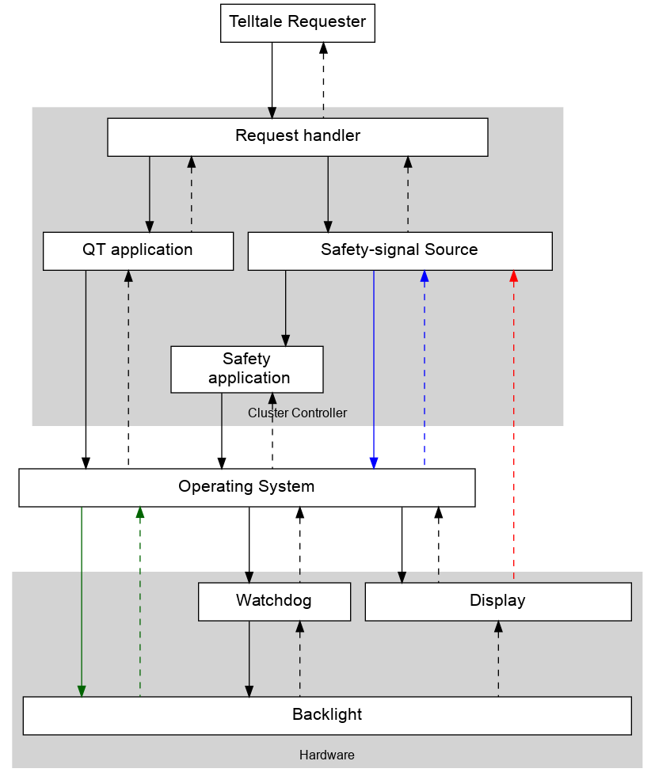

# Model the control structure

## Questions

* How does `Safety-signal Source` obtain the display image? (red arrow)
  - Does it obtain it via the OS? (blue arrows)
* Can the OS also interact with the backlight? (green arrows)

## Controllers, control actions and feedback

### Request handler

### QT application

### Safety-signal Source

### Safety application

### Operating System

### Display

### Backlight

### Watchdog
