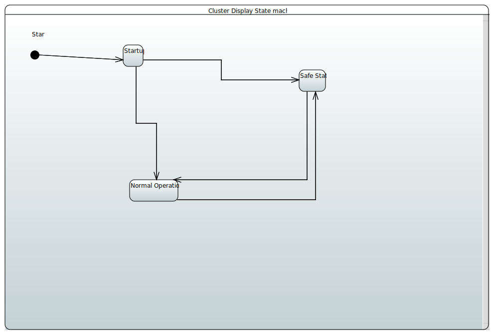
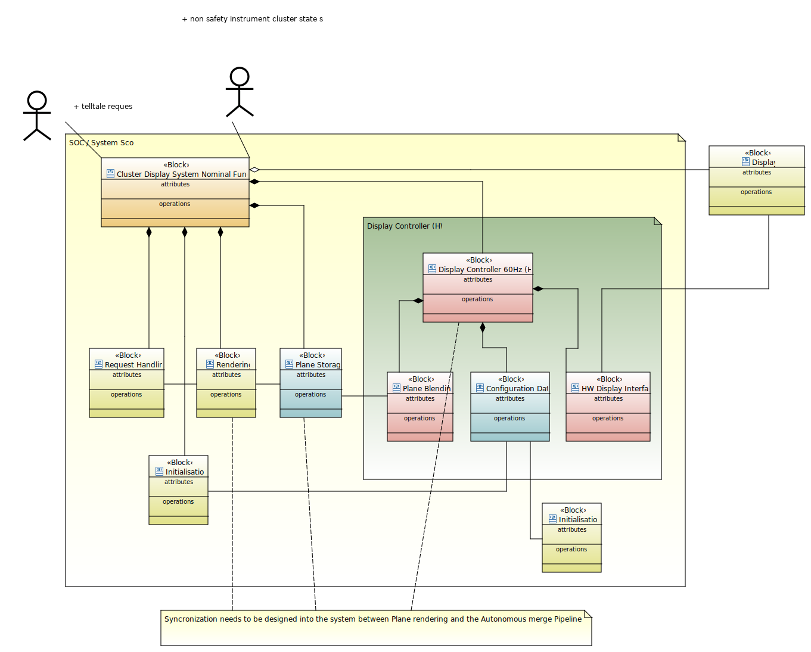

# Scope
This document describes the assumptions and predefinitions of the ELISA Automotive workgroup cluster demo use case, and defines terms and identifiers to be used in the rest of the documents.

- [Scope](#scope)
  - [Description](#description)
  - [Assumptions](#assumptions)
  - [Hardware](#hardware)
  - [System Behaviour](#system-behaviour)
    - [Operational states](#operational-states)
      - [State and state change diagram](#state-and-state-change-diagram)
    - [Block Diagram nominal function](#block-diagram-nominal-function)
    - [Block Diagram Including Safety Checking](#block-diagram-including-safety-checking)
    - [Block description](#block-description)
    - [Sequence diagrams nominal function during state normal Operation](#sequence-diagrams-nominal-function-during-state-normal-operation)
    - [Sequece diagram including telltacle checking during normale Operation](#sequece-diagram-including-telltacle-checking-during-normale-operation)
  - [Safety Goals and Safe State](#safety-goals-and-safe-state)
    - [Safety Goal 1](#safety-goal-1)
    - [Safety Goal 2](#safety-goal-2)
    - [Safe State](#safe-state)
  - [Interfaces](#interfaces)
    - [Telltale request](#telltale-request)
    - [Watchdog petting](#watchdog-petting)
    - [Image out](#image-out)
- [Safety Concept](#safety-concept)
  - [Safety Goal 1](#safety-goal-1-1)
  - [Safety Goal 2](#safety-goal-2-1)

## Description
In general, the Cluster Display shows the instruments behind the drivers wheel, including but not limited to speedometer, fuel level, Direction indicator, and telltales.
The display of telltales in particular is safety critical, since telltales are a vital part of the warning and degradation concept of various items in typical car designs.
## Assumptions
* We assume the Display displays image data fed into it with ASIL B integrity, i.e. we do not consider display monitoring of any sort, a backwards path from the Display etc.
* The HW video interface is kept variable in this design at this point.
* We assume the system is reliably supplied with energy.
* We do not consider a degradation state, it can always be added at a later stage. A degradation state would only complicate the system without giving us additional insights.
* We do not consider a specific "off" state since the black display coincides with the safe state.
* We do not consider a windown/shutdown state, it can be added at a later stage withoutout much changes to the system as it is. A windown state would complicate the system without analytical benefit, same as the degradation state.
* We assume monolithic rendering of one all in one plane, opposed to several planes. That does limit the opportunities for telltale checking to checks after the merging pipeline, but is in line with the QT based AGL cluster demo. 
  * Rationale: The more sophisticated model including several rendering planes might be necessary at some point to achieve sufficient diagnostic coverage, depending on the HW metrics of the Telltale checker element, since checking on rendering plane level allows to pinpoint the source of a malfunction with higher precision. 
    * Non Monolithic rendering also is prerequisite for a potential degradation mode, should we at some point extend the use case to include it (see above)
    * From a safety design perspective, we do not assume that the more complex multi plane variant gives us any additional insights.
    * [todo, done, recheck once more] Formulate design with two components, one checking HW or SW and one monitor in SW, to keep it a Linux use case
* We separate the telltale checking functionally to the monitoring/reaction, this enables us to transition from a HW based checker to SW based checker without having to rework the concept completely. 
* There are diferent types of tell tales indicating different information i.e. battery level or engine temperature which may have different ASIL level assigned. We limit our analysis to the worst case, seen as ASIL-B.
* [todo, confirm formulation] We assume, that the cyclical message coming in contains the already arbitrated requestet telltale status for all safety relevant telltales. 

## Hardware
In this use case, to the end of getting something running, no specific Hardware is considered. 
The demo runs on a X86-64 target within QEMU with an emulated HW watchdog ("I6300esb")

## System Behaviour
### Operational states
The system operates in three states
* Startup
  * No safety assertions
  * Image output suppressed
  * Transition to normal Operation once everything is in order
* Normal Operation
* Safe state
  * Black screen
#### State and state change diagram

### Block Diagram nominal function
Nominal function absent of safety mechanisms.

[todo] sanity check allocation to AGL cluster demo parts possible?
### Block Diagram Including Safety Checking
Block diagram including safety mechanisms

Plantuml gets into more and more trouble here to find an acceptable diagram layout...
-> papyrus, but it doesn't let me draw boxes like that
[todo] reflect checker being in HW or SW 
 
[todo] assumption checking is triggered, hw checker provides an answer -> HW spec still under NDA.

Plane storage as NUMA 
  dedicated graphics memory allocation typically
  Region blocked for GPU memory
  dedicated memory hardware would be very expensive
  maybe chip level protection mechanisms (HW)
    All SOCs have there specialties, should typically be there.

clarifying watchdog and Display can be HW / SW 
could be WD interface and Display interface 

potentially as subcomponents of our Safety Monitor block

### Block description
[todo] Not accurate anymore, this needs to be aligned with the Papyrus model.
* Telltale requester
  * ID: TT_requester
  * Description: Source of safety relevant telltale requests. Sends cyclically an E2E protected request indicating whether the telltale shall be displayed or not.
* Display
  * ID: AE_Display
  * Displays the image data delivered through the HW Display interface.
  * The Display of the image data is provided with sufficient Safety Integrity level, see assumption
* Backlight
  * ID: AE_Backlight
  * Illuminates the Display, Backlight off by means of kill line is used to transition the safe state.
* Request handling/Display State arbitration
  * ID: AE_Request_handling 
  * Function block receiving Telltale requests as well as non safety relevant Information to be displayed in the cluster display. Function block determines the state of the instruments to be rendered and sends that information to the Renderer.
* QM Plane Rendering
  * ID: AE_Rendering
  * Rendering of the image, either by CPU rasterizer or GPU. Rendered Plane is stored in Plane storage.
* Plane Storage
  * ID: AE_Plane_Storage
  * Storage for rendered Plane.
* Configuration Data
  * ID: AE_Merge_Pipeline_Configuration_Data
  * Configuration data of the merger, things like alpha/color correction upscaling etc
* Plane Blending
  * ID: AE_Plane_Blending
  * Plane blending in HW, image postprocessing, color correction etc
* HW Display Interface
  * ID: AE_HW_Display_interface
  * Physical HW display interface

### Sequence diagrams nominal function during state normal Operation

[Todo] Reflect changes in the Block diagrams
[Todo] Replace with Papyrus model sequence charts, these are no longer accurate!

### Sequece diagram including telltacle checking during normale Operation

[Todo] Reflect changes in the Block diagrams
[Todo] Replace with Papyrus model sequence charts, these are no longer accurate!

## Safety Goals and Safe State
No hara (hazard analysis and risc assessment) was performed for the system. Instead we assume the following safety goals as given:
### Safety Goal 1
<!-- While requested, the system shall display the driver warning within 200 ms or transition to the safe state within 200 ms. -->
While a safety relevant telltale is requested, the system shall display the telltale to human perception within within 200ms
* Info: Timing is debateable, could be relaxed if necessary, does not impact the safety concept (much)
* Info: The safe state of the system cluster display is the black screen.
* Info: "to human perception" means, the periods during which the system does not display the telltale are shorter, than what humans can discern (tbd ms)
* Info: A telltale is considered requested, as soon as telltale request message is received
* Info: The message delay between telltale requester and the system cluster display is out of scope and not considered in this safety concept
* Info: We assume, that the telltale requester sends a request message cyclically and E2E protected, on missing or corrupted messages the cluster display assumes all safety telltales to be requested. [todo] debate, debouncing?
### Safety Goal 2
<!--The system shall transition to the safe state within 100ms of the display showing an unrequested telltale for longer than 100 ms -->
tbd

### Safe State
The system wide Safe state is defined as display backlight switched off / black screen.

## Interfaces

### Telltale request
* The Telltale request is sent cyclically every 200 ms
* The Telltale request contains the information which telltales to show
* The Telltale request is E2E protected

### Watchdog petting
* For now we assume a windows watchdog that has to be triggered every x ms
* If necessary, we change the design to an intelligent watchdog, if we need more sophistication, such as control flow monitoring
* If the watchdog is not triggered, it resets the µP and switches off the backlight
  * This can be extended to a more realistic design where a not displayed telltale does not directly causes the safe state, but rather switches the system to using a backup image generated by the CPU instead of by the relatively error prone HW graphics pipeline.
  * We can extend this to a more realistic design including a reset counter in the µP as opportunity to look into persistent storage
### Image out
* The Image data is transferred through the HW Display Interface to the Display with a frequency of 60Hz
* We assume the protocol to have E2E protection, and the Display to react to faulty image data by going black (-> Safe state) 

# Safety Concept
## Safety Goal 1
## Safety Goal 2

