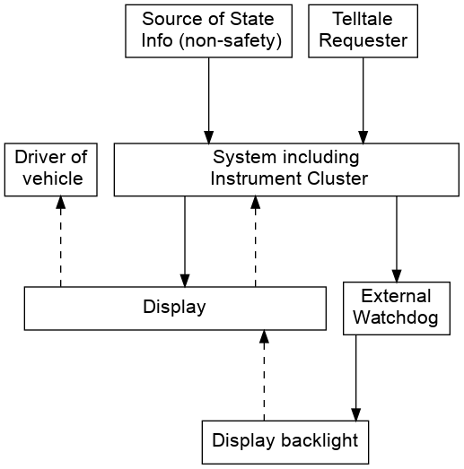

# Define the purpose of analysis

## Goals

> What kinds of losses will the analysis aim to prevent? Will STPA be applied
only to traditional safety goals like preventing loss of human life or will it
be applied more broadly to security, privacy, performance, and other system
properties? What is the system to be analyzed and what is the system boundary?

## System boundary

### Definitions
> A system is a set of components that act together as a whole to achieve some
  common goal, objective, or end. A system may contain subsystems and may also be
  part of a larger system
> A system is an abstraction conceived by the analyst. A decision must be made
about what is included in the system and what the system boundary is. With
respect to engineering, the most useful way to define the system boundary for
analysis purposes is to include the parts of the system over which the system
designers have some control.

## Notes

* For next level down, include another application (e,g, IVI) running on the
  same system as the Instrument Cluster
    - This may have a second display and other peripheral components

### Questions

* What are the telltale requesters?
    - These would help us to characterise the possible vehicle-level hazards
* Is there an IVI running on the same SoC as the Cluster?
    - Is a Hypervisor involved in the system?
* Are there any other external controllers?

## Losses

### Definitions
> A loss involves something of value to stakeholders. Losses may include a loss
  of human life or human injury, property damage, environmental pollution, loss
  of mission, loss of reputation, loss or leak of sensitive information, or any
  other loss that is unacceptable to the stakeholders.

See [Losses](telltale.md#losses).

## Notes

* L-2 and L-3 are included for context, but are not strictly safety-relevant

## System Level Hazards

### Definitions

> A hazard is a system state or set of conditions that, together with a
  particular set of worst-case environmental conditions, will lead to a loss.

See [Hazards](telltale.md#hazards)

## System-level Constraints

### Definitions

> A system-level constraint specifies system conditions or behaviors that need
to be satisfied to prevent hazards (and ultimately prevent losses)

See [System Constraints](telltale.md#system-constraints)
