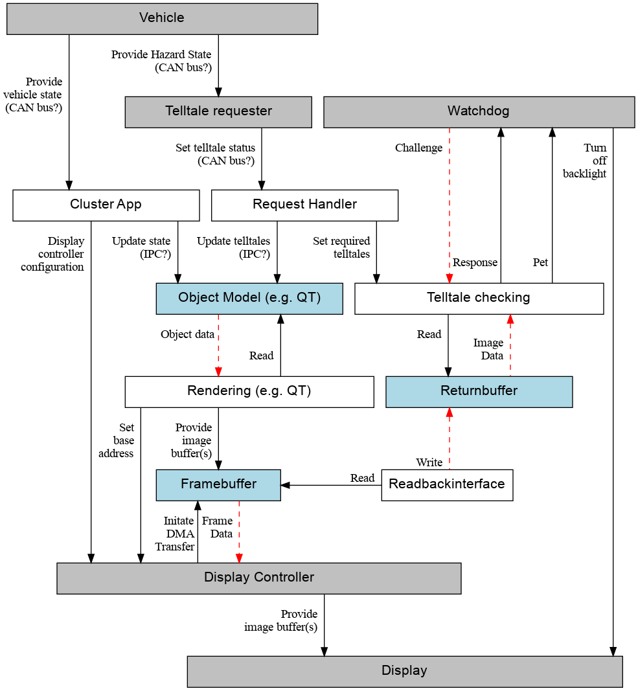

# Model the control structure

## Control Structure

## Notes

Rendering (Qt)
- Qt framework components responsible for managing display rendering
- Manages image buffer
- Provides image buffer address to Display Controller (via kernel)

Framebuffer and Display controller
- Hardware / firmware components in SoC
- Composes image and renders on the display

Request Handler
- Reveives cyclical messages from various Telltale requesters (E2E protected)
- Missing or currupted request messages are assumed to request the Telltale in question 
- Arbitrates Telltale requests by logical "or" (in case the same Telltale can be requested by several rquesters).
  - Underlying Assumption, Telltales are always designed to be safety relevant in the "activation direction"
- Sets Telltale related Rendering States accordingly (once per cycle)
- Triggers Telltale checking for the arbitrated Set of active Telltales (once per cycle)

Telltale Checking
- Checks the Displayed image against the set of requested Telltales
- If one or more requested Telltale is not present or an unrequested Telltale is present in the displayed Image, Telltale checking does not pet the watchdog.

Display
- Provides rendered image data to Telltale checking
    - How does the kernel facilitate this?

## Questions

- Why does the Request Handler communicate with the Telltale Checking by IPC?
- Does telltale requester need to know the vehicle state in order to detect a
  hazardous condition?
- Does the Vehicle set the state or do the Cluster App and the Telltale
  Requester get it?
