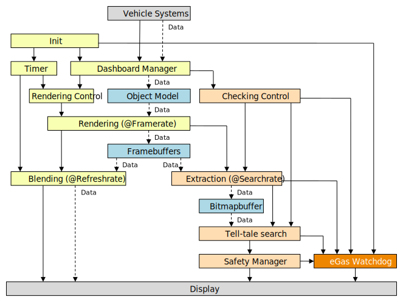
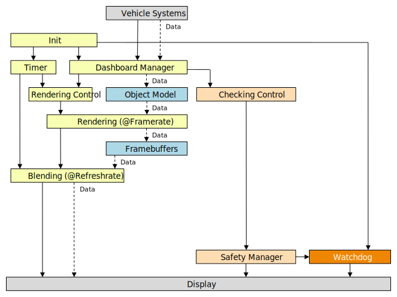

# Telltale Control and Data Flow

Work-in-progress control and data flow diagrams for the Telltale Use Case

In both diagrams:

* Blue boxes represent data structures exchanged by controllers
* Dashed lines represent data flow
* The orange box is an external hardware watchdog

## Control and data flow with framebuffer checking

In this design, a telltale checking algorithm is implemented using Linux, which extracts a rendered image of the display from the framebuffer and searches for the required telltales.

The hardware watchdog implements the eGas model.

## Control and data flow without checking

In this simplified design, the telltale checking is implemented by the display, which means that Linux has a minimal responsibility as part of the safety mechanism.

The hardware watchdog is a simple model.

TODO: Define responsibilities for Checking Control and Safety Manager
