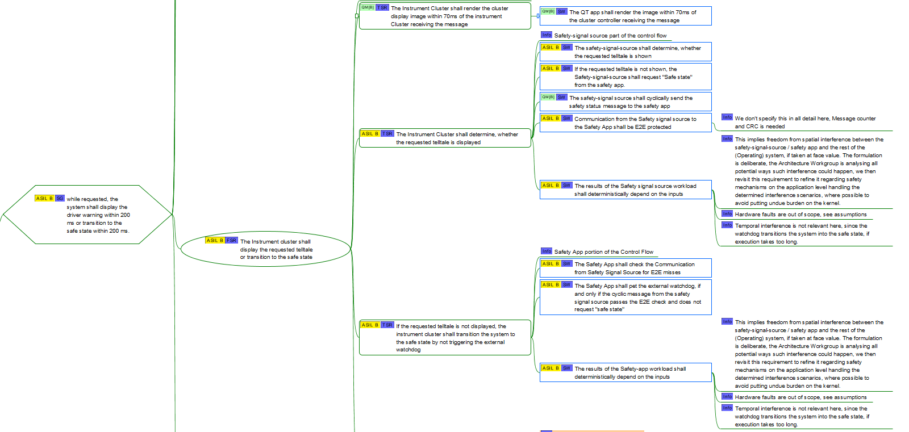
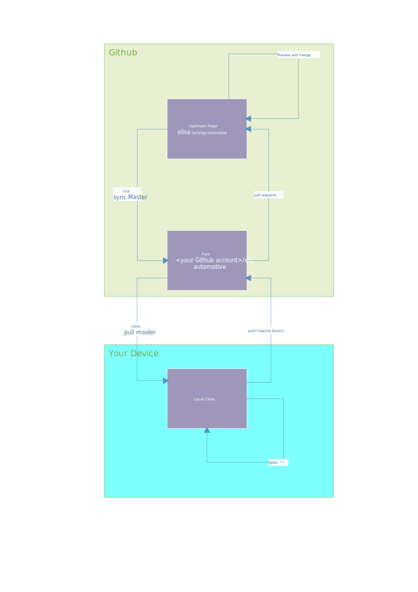

# ELISA Automotive WG
## Mission statement
The automotive workgroup discusses the conditions and prerequisites the automotive sector needs to integrate Linux into a safety critical system.
 
We focus on actual use cases from the Automotive domain to derive the technical requirements to the kernel as a basis for investigation within the Architecture Workgroup and to serve as a blueprint for actual projects in the future.

This repository contains aggreed upon and peer reviewed material for this work group, see [process description below](#contribution-workflow)

## Use case
Currently, the Automotive work group focuses on the telltale use case, i.e. warning symbols in the intstrument cluster of a car, targeting ASIL B.
## Getting in Contact, Getting Involved
### Mailing list, Calendar etc
Subscribe to our mailing list:
https://lists.elisa.tech/g/automotive

### Meetings
The Automotive workgroup currently meets twice a week
* Friday 14:00 CET: General sync call
* Thursday 9:00 CET: Working session

Note that the web calendar associated with our mailing list contains up to date information about all workgroup meetings, consider subscribing to keep up to date!

Our meeting minutes are kept at 
https://docs.google.com/document/d/1qgEkB6HBjq0ojoTSmI_E18BZco3lORK1ZZDrBH1YQo0/edit#heading=h.b7qah2h40uzb

### Newcomer Onboarding Checklist
If you are new and all this seems overwhelming, don't fret, we got you covered!

Single most important instruction: drop by the workgroup and ask, despite our effort not everything can be always kept up to date.

Other than that, here is a checklist to get you started:
* Sign up for [mailinglist and calendar](#mailing-list-calendar-etc)
* familiarize yourself with our tooling for [modelling and requirements](#tooling)
* Get to know the [contribution process](#contribution-workflow)
* Check out this repository and explore, [Repo overview](#elisa-automotive-wg---navigation-and-file-locations)
* Check out the meeting minutes and drop by our [weekly sync call](#meetings) 
* [Developers] check out the meta-elisa repository to learn how to set up a build environment, build and run the [demo](#first-iteration-of-the-use-case)

# ELISA Automotive WG - Navigation and file locations
## Google drive workgroup folder
The google drive is used for drafts, presentation and general material that has to be considered work in process. The gdrive also is used for the meeting minutes.  
https://drive.google.com/drive/folders/1FCEzywCMfk3wY6lxBoMYjfQ_DQ44S5YS
## Repo Orientation regarding the Telltale Usecase
### Original considerations
The originial considerations of the Use Case can be found in the subfolder "Initialy_discussed_system_scope" of this repository
### First iteration of the use case
The first iteration of the use case, that the meta-elisa demo is based on, can be found in the subfolder "AGL_cluster_demo_use_case" of this repository
* Item definition
* Safety Concept/Requirements

Our Implementation on top of the preexisting AGL Cluster demo is split in two repositories:
* The meta layer: (also includes build and running instructions)
  * https://github.com/elisa-tech/meta-elisa
* The sourcecode repository providing the actual code:
  * https://github.com/elisa-tech/wg-automotive-safety-app

### Second iteration of the use case
The second iteration of the use case including Eclipse Papyrus based SysML models and the ongoing STPA analysis can be found in the subfolder "Cluster_Display_Use_Case_v2"
* Item definition [WIP]
* SysML models [WIP]
* STPA analysis [WIP]

The models are also visible via github page deployment as online viewer at:

https://elisa-tech.github.io/wg-automotive/

The html export might not always be up to date with the models, generation is not automated (yet)

# Tooling
## Requirements
Requirements and Safety concepts are stored and handled as Freeplane Mindmap using the Functional Safety Addon specifically developed for the task.
* https://www.freeplane.org/wiki/index.php/Home
* https://github.com/Jochen-Kall/Safety_concept_tool


## SysML modeling
SysML models are done with Eclipse Papyrus with SysML v1.6 Plugin
* https://www.eclipse.org/papyrus/
* https://marketplace.eclipse.org/content/papyrus-sysml-16

# Contribution workflow
To make collaboration as frictionless as possible, the automotive workgroup uses the following github based workflow.
## Prerequisites
* Git
* Github account
## Workflow
* If you did not fork and clone yet
  * Fork the upstream repo and clone your fork to get a local working copy, details see [click](#initial-setup---forking-and-cloning)
* If you already forked the repository and cloned your fork
  * Make sure to start your work on the most recent version of the upstream master branch, for details see [click](#syncing-your-fork-and-local-working-copy-with-the-upstream-repository)
* Create a feature branch based on "master/main" to start your work on [click](#creating-a-feature-branch)
* [Optional for non code repositories] If you suspect the files you intend to work on are being worked on by other members of the group as well, or you want to discuss your planned work beforehand, create an Github issue, see [click](https://docs.github.com/en/issues/tracking-your-work-with-issues/creating-an-issue). 
If you did create an issue, it is best practice to reference the issue in your commit messages.
* Commit changes and push them to your fork see [click](#committing-and-pushing) 
* Getting your completed work back into the main repository, aka Pull Requests
  * Make sure your feature branch is still based on the most recent master in the upstream repository, see [click](#rebasing-a-feature-branch)
  * Make sure all your commits are signed off 
    * If they are not, github will notify you of failed DCO checks and provide instructions how to sign off afterwards, does not always get it right though.
  * Make sure you pushed all commits of your feature branch to your fork on github
  * Create a cross fork pull request from your feature branch to elisa-tech/wg-automotive:master on Github
  * Important! Do not continue to push revisions to the feature branch, unless you want the changes to become part of the pull request, the moment you push revisions to github, the pull request will be amended automatically!  
* You might be asked to rebase your feature branch again, this can become necessary if a pull request is merged in the meantime that has conflicting changes with your feature branch (See [click](#rebasing-a-feature-branch)). 
* Review Process
  * The pull request is visible and open for comments and discussion on Github.
  * Review is considered done if no more unresolved findings/comments remain, no checks fail and 2 group members approved the change.
  * Merge ready Pullrequests are put on the next Workgroup synccall agenda for discussion, if consensus is found, the pullrequest is merged by an maintainer.

# Git Newbie section
This section serves as reference for members new to GIT, to be read on demand.
All the GIT black belts out there can stop reading at this point in good concience. 

## Intital Setup - Git etc
For this workflow, having Git installed and configured is essential. 

Linux users install the git package, Windows users grab git for Windows [click](https://git-scm.com/downloads).

Both groups need to provide Name and email adress to git:
```
git config --global user.email "you@example.com"
git config --global user.name "Your Name"
```

Depending on your preferences and love/tolerance of the commande line, you might also want to get a graphical GIT interface such as
* Tortoise git (Windows)
* Gitkraten
## Github Workflow in a nut shell

## Initial Setup - Forking and Cloning
* Fork elisa-tech/wg-automotive within Github [Instructions](https://docs.github.com/en/get-started/quickstart/fork-a-repo)
* Clone the fork [Instructions](https://docs.github.com/en/repositories/creating-and-managing-repositories/cloning-a-repository)
## Creating a feature branch
With your fork of the repository cloned, proceed to create a feature branch, push it up to github and make your branch track the newly created feature branch.
Make sure to base your feature branch the most recent commit, i.e. sync your fork befor you start your work [click](#syncing-your-fork-and-local-working-copy-with-the-upstream-repository)

Short example using command line git in the top level folder to fetch the latest revision and create a new branch by the name of "my_feature":
Assuming your fork is on par with the upstream repository, fetch origin to get the revisions to your local clone
```
git fetch origin
```
Create your feature branch based of origin/master: note the flag --no-track to avoid tracking origin/master, since we are constructing a new feature branch.
```
git checkout -b my_feature --no-track origin/master
```
Push the new branch to your fork on github and make your branch track it:
```
git push -u origin my_feature
``` 

## Committing and pushing
* Commit your changes within your local copy using either command line git or a graphical interface (tortoise git, gitkraken etc)
  * Quality check your commits
  * Sign off your commits using the --signoff flag when using command line git, or the according setting of your GIT Gui, see [click](#signing-off-and-dco) 
  * Provide a short concise commit message describing the changes
  * Reference the github issue you are working on, if applicable with the hashtag syntax #<<"issue number">> in your commit message and pull request message [click](https://docs.github.com/en/issues/tracking-your-work-with-issues/linking-a-pull-request-to-an-issue) This will link your commits/pull request to the issue and make it visible in the github interface
* Push regularly to your Github fork to have a backup of your work
```
git push origin
```

## Signing off and DCO
Using the --signoff flag when committing conveniently adds the signoff line to your commit message
```
Signed-off-by: <your name> <<your email adress>>
```
What if I forgot?
Github will complain when you create a pull request, having signed commits is required!
How to fix it then? 
Signing off on the last 3 commits for instance is done by rebasing the current branch on an earlier commit:
```
git rebase HEAD~3 --signoff
```
Keep in mind, since this changes the history of the repo, if you already pushed, pushing again to overwrite the changelog requires using the --force flag!


## Syncing Your fork and local working copy with the upstream repository
Before starting your work, you need to make sure the files you start out with are up to date to avoid having to fix that afterwards.
This workflow involves three relevant destinations
* The original upstream repository [on Github servers] elisa-tech/wg-automotive
* Your fork of the repo [on Github servers]
* The clone of your fork on your local machine. 

To ensure your files are up to date, your fork needs to be syncronized with the upstream repository to pick up any changes merged since the last time you synced your fork. This sync can be done in the github browser interface with just one click, provided your master branch has no conflicts with the master branch of the upsream repository. To ensure this property, its best to never commit to the master branch of your fork at all. 
Github description:
https://docs.github.com/en/github/collaborating-with-pull-requests/working-with-forks/syncing-a-fork#syncing-a-fork-from-the-web-ui

With your fork syncronized with the upstream repository, we have to make sure any new commits picked up from the upstream repository are propagated to your local clone.
Assuming you refrain from committing to your master branch, the changes can be pulled and fast forwarded:
Command line GIT example with a shell opened in the directory of your local checked out copy:
```
git fetch origin
git checkout master
git pull origin --ff-only
```
The flag --ff-only restricts the pull operation to fast forward merges, this operation will fail if the current revision in your local copy is not a direct ancestor of the upstream revisions to be pulled, i.e. if you by mistake committed to your local master branch.
For a detailled explanation why that would be highly undesirable even if the merge has no conflicts see [click](https://blog.sffc.xyz/post/185195398930/why-you-should-use-git-pull-ff-only-git-is-a)

After these two steps, the master branch of all three repositories are synced up, you can inspect the latest revision in the master branch and you are prepared to base a feature branch on synced up master branch.

## Rebasing a Feature Branch
While you worked on your feature branch, other pull request might have been merged into the master branch of the upstream repository.
Since could lead to conflicts when merging your branch, you need to make sure that your feature branch is based on the current revision, not the one you started your work with.
This we accomplish by a two step process
* Syncing up your local master with the upstream master, see [click](#syncing-your-fork-and-local-working-copy-with-the-upstream-repository)
* Rebasing your feature branch on master, i.e. GIT will find the bifurcation at which your branch split off master, and reapply all commits in your branch since then to the current master, which results in your branch being "rebased" on the current master instead.

Command line git example:
```
git fetch origin
git checkout my_feature_branch
git rebase origin/master
```

In case of conflicts, rebase will interrupt the process, give you a chance to resolve the conflict and continue.
For a detailled description of the process and commands involved, see [click](https://git-scm.com/docs/git-rebase)

Now your feature branch is based on the most recent master branch and can be merged without conflicts.
Pushing your rebased feature branch to your github fork requires the use of the -force flag, since rebasing changes the commit history already present in your fork.

```
git push origin -force 
```


